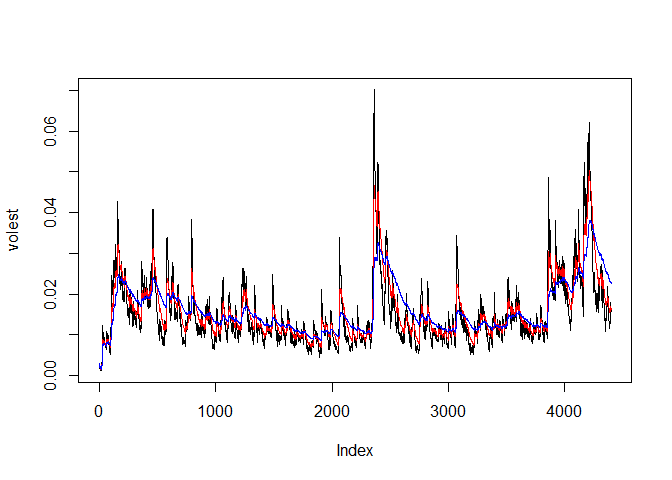

# Yahoo Stock Volatility
Vishi Cline  
November 13, 2016  


```r
knitr::opts_chunk$set(echo = TRUE)
```

# Install Packages

```
## Warning: package 'tseries' was built under R version 3.2.5
```

# Download Data

```r
SNPdata<-get.hist.quote(instrument = 'SPY',quote="Close")
```

```
## Warning in download.file(url, destfile, method = method, quiet = quiet):
## downloaded length 418196 != reported length 200
```

```
## time series starts 1993-01-29
## time series ends   2016-11-11
```

```r
length(SNPdata)
```

```
## [1] 5993
```

# Calculate Log Returns

```r
SNPret<-log(lag(SNPdata))-log(SNPdata)
length(SNPret)
```

```
## [1] 5992
```

# Calculate Volatility measure

```r
SNPvol<-sd(SNPret) * sqrt(250)*100
SNPvol
```

```
## [1] 18.68468
```

# Calculate volatility and a continuous lookback window using various decay factors.

```r
Vol<-function(d,logrets){
  var=0
  lam=0
  varlist<-c()
  for (r in logrets){
    lam=lam*(1-1/d)+1
    var=(1-1/lam)*var+(1/lam)*r^2
    varlist<-c(varlist,var)
  }
  sqrt(varlist)
}

#volatility with different weights
volest<-Vol(10, SNPret)
volest2<-Vol(30, SNPret)
volest3<-Vol(100, SNPret)
```

# Plot the results

```r
plot(volest, type="l")
lines(volest2, type="l", col="red")
lines(volest3, type="l", col="blue")
```

<!-- -->
